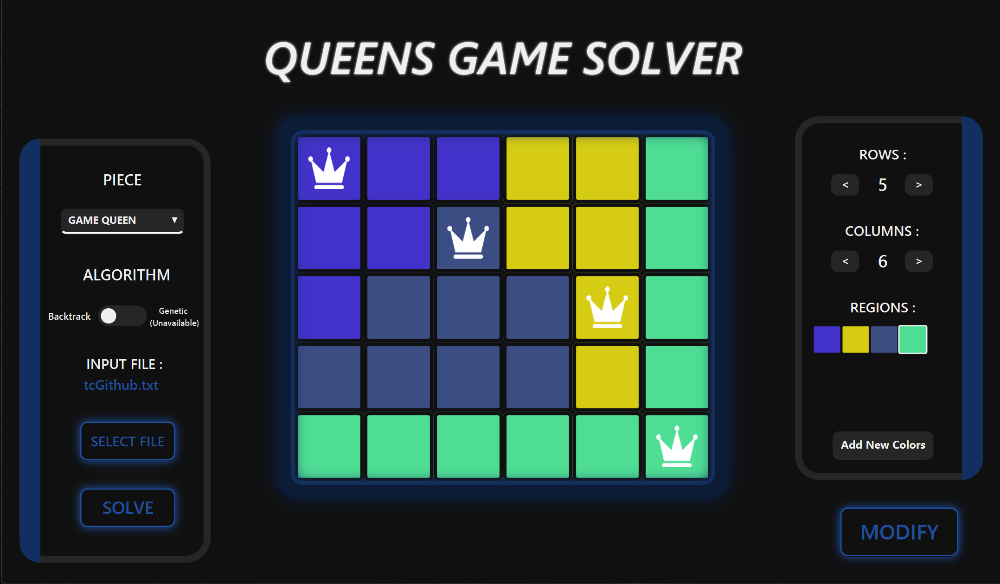
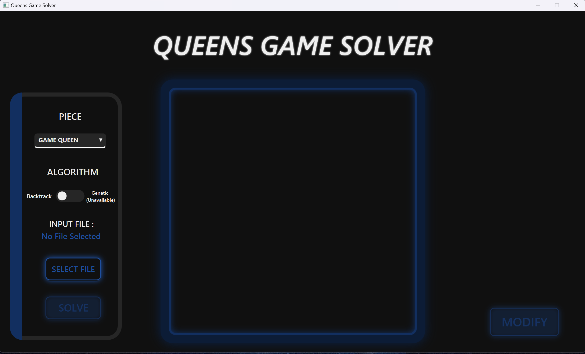
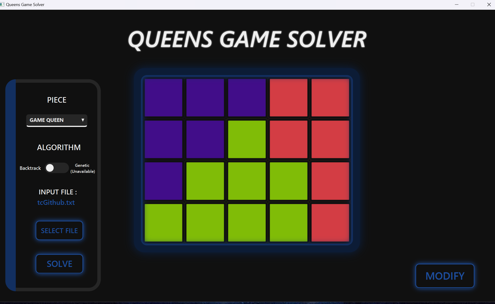
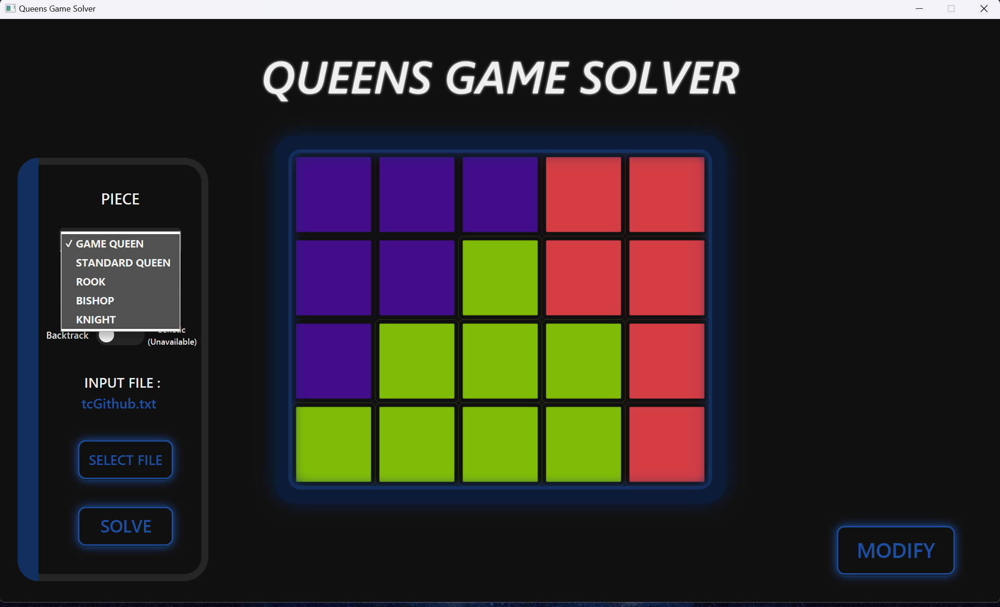
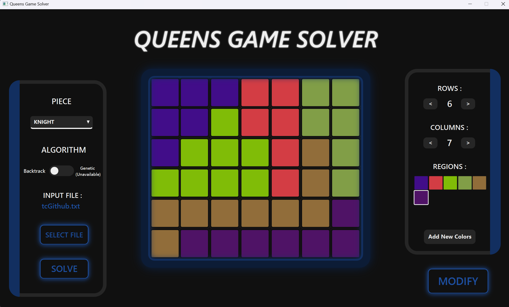
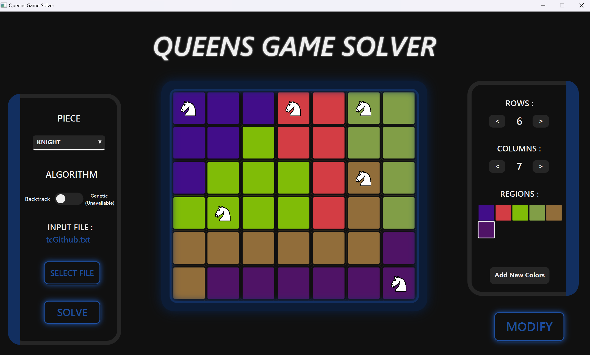

<h1 align="center">♛♕ Queen Game Solver ♕♛</h1>

Linkedin's Queen Game Solver as my submission for Computational Engineering Laboratory Assistant Selection. Implemented using Java language and utilizing JavaFX library for a rich graphical user interface (GUI).

<br>

<div align="center">
   <br />
</div>

<br>

## Getting Started

### Prerequisites

Before you start, ensure you have the following installed:

- **Java Development Kit (JDK) 22 or higher:** [Download JDK](https://www.oracle.com/java/technologies/downloads/#java22) or use [OpenJDK](https://openjdk.java.net/).
- **Apache Maven 3.8.0 or higher:** [Download Maven](https://maven.apache.org/download.cgi).
- **JavaFX SDK 22.0.2 or higher:** [Download JAvaFX SDK](https://jdk.java.net/javafx22/).

### Installation

Follow these steps to set up the project locally:

1. **Clone the repository:**
   ```bash
   git clone https://github.com/Farhannr28/Queen-Game-Solver

2. **Navigate to the directory including pom.xml:**
   ```bash
   cd queen-game

3. **Build the Application:**
   ```bash
   mvn clean package

### Run the Application

  Firstly, locate the directory of your JavaFX SDK. Copy the path to javafx-sdk-xx.x.x\lib and navigate to the directory of your resulting .jar file. Run the following command:
  
  ```bash
  java --module-path '[JavaFX SDK /lib path]' --add-modules javafx.controls,javafx.fxml -jar queengame-1.0-SNAPSHOT.jar
  ```

<br>

## Usage

The following are the steps to solve a Queen's game puzzle. Once the application is opened, this is what the GUI looks like.

<div align="center">
   <br />
</div>

1. **Create a .txt input file:**

   The input is formatted as follow

   ```
     [number of rows] [number of columns]
     [number of regions]
     [ grid layout of characters
       ...
       ...
       ...
                 ]
   ```

   For example, a simple testcase might look like

   ```
     4 5
     3
     A A A @ @
     A A 2 @ @
     A 2 2 2 @
     2 2 2 2 @
   ```

2. **Import the .txt file:**

   Click the *Select File* button to open File Selector window. If the input is valid, your grid will be displayed as follow

   <div align="center">
      <br />
   </div>

3. **Select your piece:**

   In the choice box, select your chess piece to use for this puzzle which includes:
   - LinkedIn's Queen
   - Standard Chess Queen
   - Rook
   - Bishop
   - Knight

   <div align="center">
      <br />
   </div>

4. **Select your Algorithm:**

   In the toggle button choose an algorithm to solve the puzzle. For now only Backtracking Depth First Search is implemented, altough a Genetic Algorithm might be added in the future.

5. **(Optional) Modify the grid:**

    You can modify the puzzle grid to your liking by first clicking the *Modify* button. A new section will pop up where you can:
    - Increase/Decrease the number of rows and column (Maximum of 15x15).
    - Add a new color for a region.
    - Change the color of a grid square by picking a color on the color panel then click any square to change it.

    Make sure that the grid is valid after modification, the program will report if otherwise.
     <div align="center">
        <br />
     </div>

  6. **Start Solving:**
     
     Click the *Solve* button to initiate your choosen Algorithm
  
  7. **See the solution:**
  
     The solution will be displayed on the grid. Your chess pieces are located on where they must be to solve the puzzle. If there's no possible configuration, the app will report.
  
     <div align="center">
        <br />
     </div>

<br>

## Tech Stack
  The program is written using the Java programming language. The only library used is JavaFX to support my application with rich GUI.


## Program Structure
  This project is structured as below
  ```
    queen-game
    ├───src
    │   ├───main
    │   │   ├───java
    │   │   │   └───com
    │   │   │       └───farhannr28
    │   │   │           └───queengame
    │   │   │               ├───controller
    |   |   |                   ├───FileController.java
    |   |   |                   ├───GridController.java
    |   |   |                   └───MainSceneController.java
    │   │   │               ├───models
    │   │   │                   ├───Cell.java
    |   |   |                   └───GridInput.java
    │   │   │               ├───services
    │   │   │                   ├───Backtrack.java
    |   |   |                   ├───PieceValidator.java
    |   |   |                   └───RegionProcessor.java
    │   │   │               ├───utils
    │   │   │                   └───Util.java
    │   │   │               └───App.java
    │   │   └───resources
    │   │       └───com
    │   │           └───farhannr28
    │   │               └───queengame
    │   │                   ├───img
    │   │                   ├───stylesheet
    │   │                       └───styles.css
    │   │                   └───view
    │   │                       └───mainScene.fxml
    │   └───test
    │       └───java
    │           └───com
    │               └───farhannr28
    │                   └───queengame
    └───target
  ```

## Backtrack Algorithm
  Backtracking is a general algorithmic technique that involves exploring all possible solutions to a problem by incrementally building candidates to the solution and abandoning each candidate (i.e., "backtracking") as soon as it is determined that the candidate cannot possibly lead to a valid solution. In this algorithm, you start with an empty solution and explore each possibility by adding elements to the solution step by step. If a certain path or choice does not lead to a feasible solution, the algorithm backtracks to the previous step, removing the last added element and trying a different path. This process continues until all possibilities are exhausted or until the desired solution is found. Backtracking is often implemented using recursion, which simplifies the exploration of all potential candidates.  This method is particularly useful for solving combinatorial problems, such as the N-Queens problem, which the Queen's game is based on.
  
  The reason of this algorithm's use for this app is due to it's optimization techniques. Backtracking tends to be inefficient for large problems due to its exhaustive nature, but the use of pruning speeds up the algorithm significantly. For the following game, there a chess piece attacking rules which could encompass many squares. This means a lot of possibilities are getting pruned, making our backtracking algorithm beneficial for this case. Not too mention that it's only needed to search one solution for the puzzle, which by a systematic search such as backtracking, a solution will neevr be missed.

  The implementation for the actual solver itself is not as simple. As soon as an input file is selected, the program does a Depth First Search on the input grid to create what i call a region paths. This is simply a path to walk through a whole component, where each component is every square sharing a color. After the paths are created we start the backtracking algorithm. Note that the implementation slightly differ for each different chess piece. Starting from the first region, we pick the first square on it's path. One by one we start adding a square from every other region, doing such in order of their paths. But, we need to make sure no piece attacks each other. To handle this i created a bounding function for each pieces attack move. If a position does not satisfy the bounding function, then the branch is pruned. This is repeated until the each region is filled with exactly one chess piece.
  
## Refrences
  - [Original Game](https://www.linkedin.com/games/queens/)
  - [My major's class slide about backtracking (in Indonesian)](https://informatika.stei.itb.ac.id/~rinaldi.munir/Stmik/2020-2021/Algoritma-backtracking-2021-Bagian1.pdf)
  - [JavaFX Documentation](https://openjfx.io/)

## Authors

Project Author: **Farhan Nafis Rayhan - 13522037** - [(GitHub page)](https://github.com/Farhannr28)
